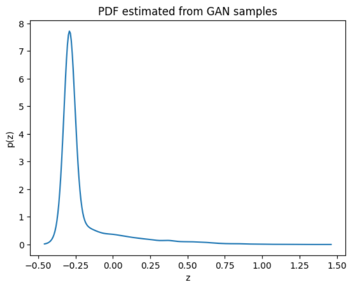

# Probability-Density-Functions-Assignment-2-UCS654

This repository contains the solution for Assignment–2, which focuses on learning an unknown probability density function of a transformed random variable using a Generative Adversarial Network (GAN).

---

## Dataset Description

- Feature used: NO₂ concentration (no2)
- Source: India Air Quality Dataset (Kaggle)
- Non-numeric and missing values are removed before processing

---

## Step-1: Transformation of the Random Variable

Each value of the original random variable x (NO₂ concentration) is transformed using the following nonlinear function:

z = x + a_r * sin(b_r * x)

### Roll Number

r = 102317097

### Transformation Parameters

a_r = 0.5  
b_r = 0.8999999999999999  

These parameters introduce a nonlinear perturbation to the original data. As a result, the transformed variable has an unknown and analytically intractable probability distribution.

---

## Step-2: PDF Learning Using GAN

- The transformed variable z is assumed to be sampled from an unknown distribution
- A Generative Adversarial Network (GAN) is trained using only samples of z
- No parametric distribution (Gaussian, exponential, etc.) is assumed

### GAN Overview

- Generator:
  - Takes noise sampled from a standard normal distribution N(0,1)
  - Generates synthetic samples of z

- Discriminator:
  - Distinguishes between real transformed samples and generated samples

- Both networks are trained adversarially to learn the underlying distribution

---

## Step-3: PDF Approximation from Generator Samples

- After training, a large number of samples are generated from the trained generator
- The probability density function is estimated using Kernel Density Estimation (KDE)

---

## Estimated PDF from GAN Samples

The figure shows the estimated probability density function of the transformed variable z obtained from GAN-generated samples.  
The sharp peak indicates a dominant mode, while the long tail reflects the effect of the nonlinear transformation.  
The smooth curve confirms stable GAN training and successful density learning without assuming any parametric form.

---

## Key Observations

- The GAN successfully learns the distribution of the transformed variable using data only
- Generated samples capture both dominant mode and tail behavior
- KDE provides a smooth approximation of the learned probability density function

---

## Conclusion

This assignment demonstrates the use of generative models for learning unknown probability density functions directly from data. The GAN-based approach effectively models the transformed NO₂ concentration values and enables PDF estimation without relying on predefined distributional assumptions.
